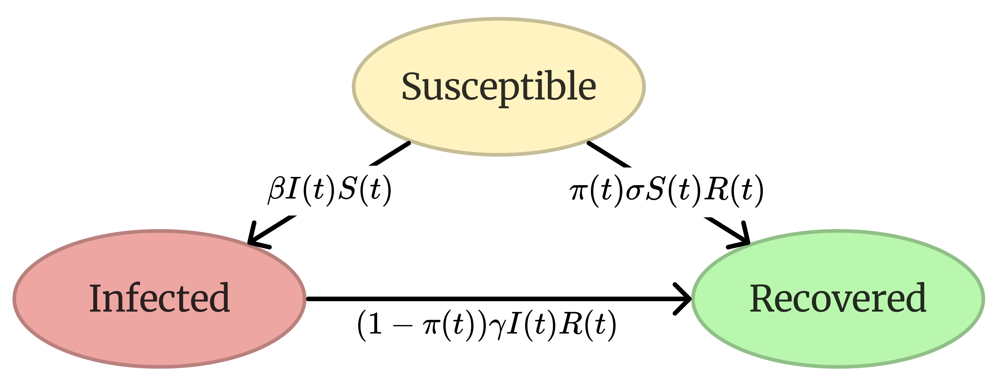
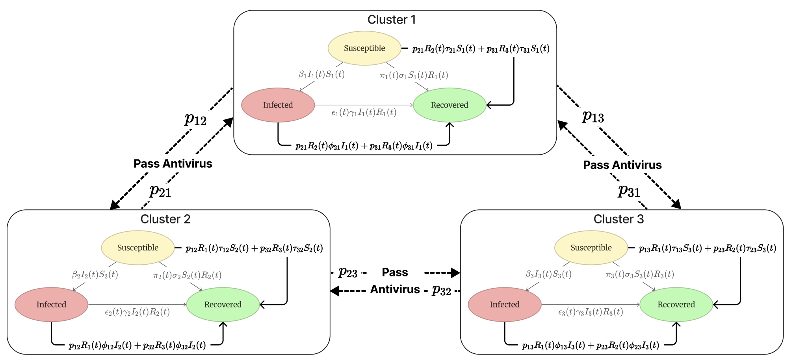
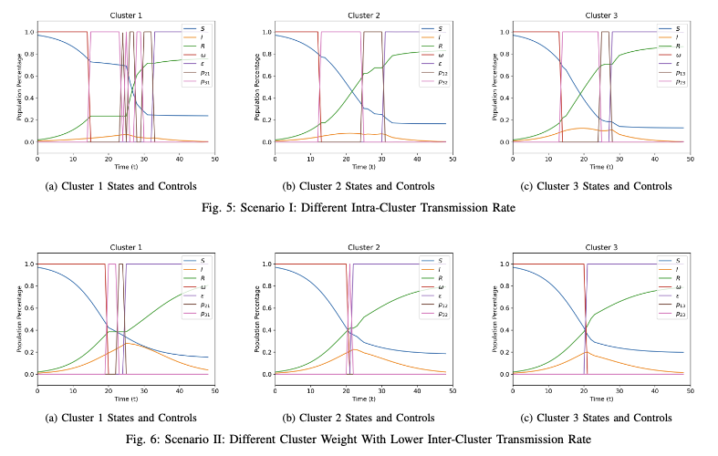

## Optimal Control for Antivirus Routing in Epidemiological-Based Heterogeneous Computer Network Clusters

----
To be published as a conference paper at ACC 2024: [Optimal Control for Antivirus Routing in Epidemiological-Based Heterogeneous Computer Network Clusters](assets/preprint.pdf)

### Implementation
Single Cluster Antivirus Routing.


Heterogeneous Clusters Antivirus Routing.


----

### Abstract
Maintaining productivity in computer networks amidst virus threats has been an ongoing research challenge. Existing studies often use epidemiological-based ordinary differential equations (ODEs) to model virus and antivirus propagation. However, these models typically oversimplify the situation by not accounting for the heterogeneity among different network clusters and ignoring real-world protocol constraints, such as the inability of nodes to communicate simultaneously with nodes in different groups.

In this work, we develop a novel model that addresses these limitations by incorporating both heterogeneity and protocol constraints. We start by proposing a single-cluster ODE model where both virus and antivirus propagate. This model is then extended to networks with heterogeneous clusters. Utilizing these models, we formulate the objective of maximizing productivity as an optimization problem solvable through quasi-Newton methods.

We also validate the optimal control's effectiveness in the single-cluster model using Pontryagin's Maximum Principle (PMP). Through experimentation and simulation, we discover that the optimal control policy follows a bang-bang structure and effectively prioritizes actions based on the heterogeneity of clusters.

---- 

### Installation
    pip install -r requirements.txt

----
### Benchmark
Benchmark for Single Cluster (T = 100):

| Parameters          | Values                |
|---------------------|-----------------------|
| \[S(0), I(0), R(0)] | \[0.97, 0.02, 0.01]   |
| \[ β, σ, γ, δ]      | \[0.1, 0.1, 0.1, 0.1] |


Benchmark for Three Heterogeneous Clusters (T = 50, lr = 10e-7):
- Scenario I: Different beta, everything else stay the same.
- Scenario II: different weights, everything else stay the same/

| Parameters             | Values              |
|------------------------|---------------------|
| \[S1(0), S2(0), S3(0)] | \[0.97, 0.97, 0.97] |
| \[I1(0), I2(0), I3(0)] | \[0.01, 0.01, 0.01] |
| β (Scenario I)         | \[0.1, 0.1, 0.2]    |
| β (Scenario II)        | \[0.2, 0.2, 0.2]    |
| σ                      | \[0.2, 0.2, 0.2]    |
| γ                      | \[0.15, 0.15, 0.15] |
| τ (Scenario I)         | \[0.15, 0.15, 0.15] |
| τ (Scenario II)        | \[0.1, 0.1, 0.1]    |
| φ (Scenario I)         | \[0.15, 0.15, 0.15] |
| φ (Scenario II)        | \[0.1, 0.1, 0.1]    |
| w (Scenario I)         | \[1, 1, 1]          |
| w (Scenario II)        | \[1, 2, 3]          |

### Experiment Results
Run Single Cluster Scenario
```
python src/sir_bfgs.py
```

Run Heterogeneous Clusters Scenarios
```
python src/cluster_bfgs.py
```



### Citation
    To be Updated ..